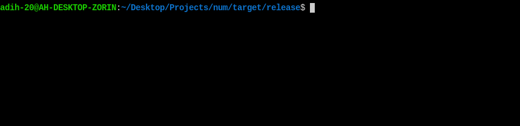

# num (Network Uptime Monitor)


Network Uptime Monitor (num) is a CLI program written in Rust that conducts analysis on the uptime of a network. It performs pings on an address/URL and logs latency and time data to a CSV file.


**Features**

- Small disk, memory, and CPU footprint
- Configurable TTL, delay, timeout, number of bytes sent, and output directory
- Color-coded text for easy parsing of output
- Support for logging time/latency data to a CSV, and a configuration JSON file
  to track environment variables of previous runs
- Cross platform (currently builds on Linux/Windows 10-11)


## Installation

Prebuilt packages are currently WIP.

**Building:**
```bash
  git clone https://github.com/adih-20/num.git
  cd num
  # Run this for debugging purposes
  cargo build
  # Run this for optimized binary
  cargo build --release
```
The resulting binary (`num`) will be found in `./target/debug` or `./target/release/` depending on which type you built for.

## Usage

To learn how to use `num`, invoke `num` with the `-h` or `--help` argument.

CSV files created by `num` follow the following format:
```csv
Timestamp,Latency(ms)
2023-05-31 17:10:38.662942381 -05:00:00,51
2023-05-31 17:10:43.630355854 -05:00:00,42
2023-05-31 17:10:48.630140626 -05:00:00,48
2023-05-31 17:10:53.630425122 -05:00:00,47
...
```
The configuration JSON file contains the runtime environment variables and follows the following format:
```json
{
  "address": "140.82.114.3",
  "num_bytes": 4,
  "timeout": "1000ms",
  "ttl": 128,
  "delay": "120s"
}
```
`num` outputs a minified JSON which can be pretty printed with a tool like `jq`.
## Screenshots




## Contributing

Contributions (Pull Requests) are currently closed for this project.


## License

`num` is licensed under the AGPLv3. See `LICENSE` for more information.
```
Copyright (C) 2023 Aditya Hadavale

This program is free software: you can redistribute it and/or modify
it under the terms of the GNU Affero General Public License as published by
the Free Software Foundation, either version 3 of the License, or
(at your option) any later version.

This program is distributed in the hope that it will be useful,
but WITHOUT ANY WARRANTY; without even the implied warranty of
MERCHANTABILITY or FITNESS FOR A PARTICULAR PURPOSE.  See the
GNU Affero General Public License for more details.

You should have received a copy of the GNU Affero General Public License
along with this program.  If not, see <https://www.gnu.org/licenses/>.
```

